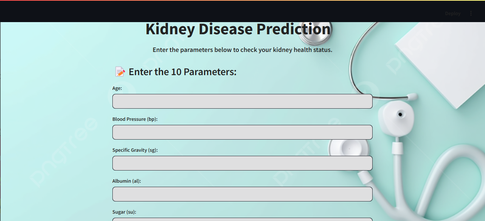

# Kidney Disease Prediction App

This project is a **machine learning-based web app** designed to predict the likelihood of kidney disease based on certain health parameters. The goal is to assist healthcare professionals and patients in identifying potential kidney issues early, ensuring timely intervention.

The app takes various health parameters as input, analyzes them using a trained machine learning model, and provides a prediction indicating whether the patient is in **good condition** or at **risk of kidney disease**.



## Features

- **User-friendly Interface**: Built using Streamlit, the app provides a simple, intuitive interface for users to input data and receive predictions in real time.
- **Accurate Predictions**: Utilizes machine learning models to predict kidney disease risk based on health parameters such as age, blood pressure, blood sugar, and more.
- **Instant Feedback**: Users receive a prediction with clear information on whether their health condition requires further attention.
  
## How to Use

1. **Clone this repository**:
   ```bash
   git clone https://github.com/Jayaragul/kidney.git
